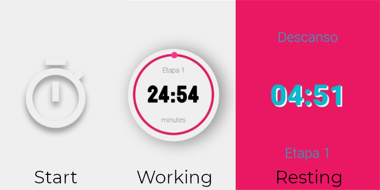

<p align="center">
  
</p>

<h1 align="center">
  Pomodoro ⌚<br>
  <code>by raphaeldevs</code>
</h1>

> Minha versão do famoso pomodoro feita com HTML, CSS e Vanilla JS

## 💡 Aprendizados

- Manipulação de SVGs
- Bastante coisa de circunferência 🤯
- Animações pelo JS `element.animate(keyframes, config)`
- Animações com Promises (nessa eu aprontei das minhas 😅)

```javascript
// Exemplo de animação pelo JS com Promise
const animation = element => {
  const keyframes = [{ opacity: 0 }, { opacity: 1 }]

  const config = {
    duration: 1000
  }

  return new Promise(resolve => {
    element.animate(keyframes, config)

    setTimeout(() => resolve(), config.duration)
  })
}

await animation(elementToAnimate)

// Fazer alguma coisa somente após animação
```
